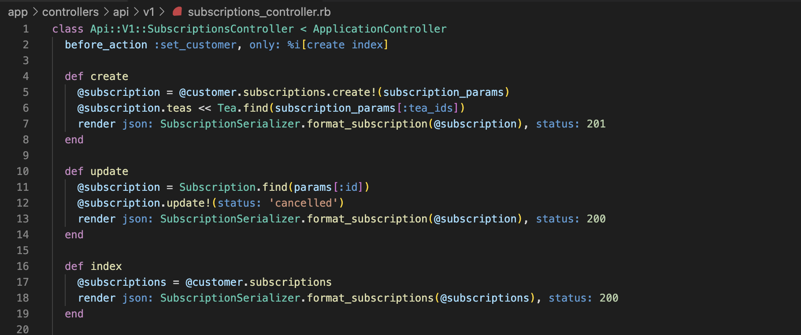
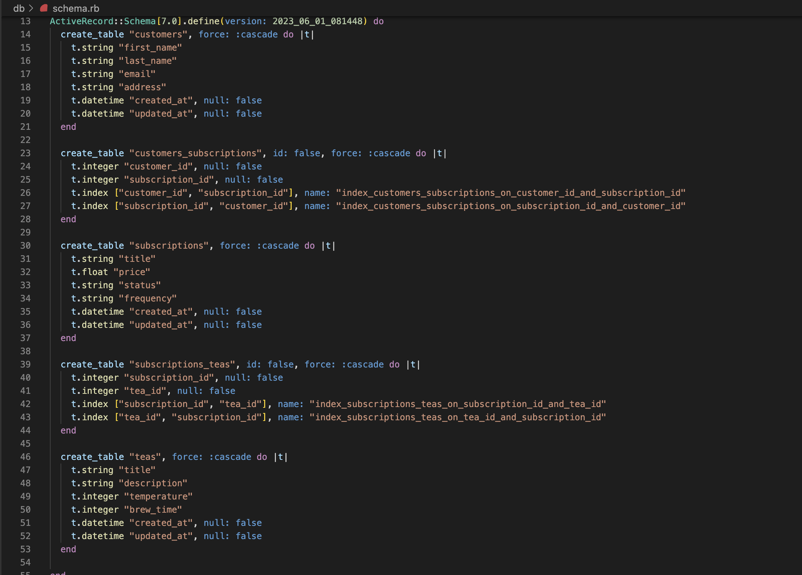

# tea_subs_api
> Back end API with three requested endpoints.

tea_subs_api is a back end application api that manages the subscriptions statusses of customers and tea flavors within said subscriptions. It holds three endpoints currently that allows a front end user to call on them with provided information and see a proper return. This README will provide needed information to use this API as intended.



## Setup

1. Clone this repository to your local machine: **'git@github.com:Isaac3924/tea_subs_api.git'**
2. Install dependencies: **'bundle install'**
3. Configure the database by running **'rails db:setup'**
4. Seed the database by running **'rails db:seed'** Here is a screenshot of the schema to further understand relations and attributes:

5. Start the server by running **'rails server'**
6. Visit **'http://localhost:3000'** in your web browser to confirm that the app is running.
7. The API endpoints available are a POST to **'http://localhost:3000/api/v1/customers/1/subscriptions'**, a GET to **'http://localhost:3000/api/v1/customers/2/subscriptions'**, and a PATCH to **'http://localhost:3000/api/v1/subscriptions'**. 
8. Use Postman to test the FIRST TWO endpoints as is for responses. The database should seed with the needed data in order to receive a JSON in return.
9. For the third endpoint, you will need to provide a JSON body to receive a response. The expected format for the body is as follows:
```json
{
    "subscriptions": {
        "title": "Example Subscription",
        "price": 178.99,
        "status": "active",
        "frequency": "Time is not a one way street",
        "tea_ids": [1, 2, 3]
    }
}
```

## Usage example

This application is fairly straightforward. Three endpoints to return needed information. Can be further updated with extra endpoints, but for now, works as an MVP.

## Meta

Isaac Alter – [@MyLinkedIn](https://www.linkedin.com/in/isaacalter/) – isaacalter3924@gmail.com

[https://github.com/Isaac3924](https://github.com/Isaac3924/)
